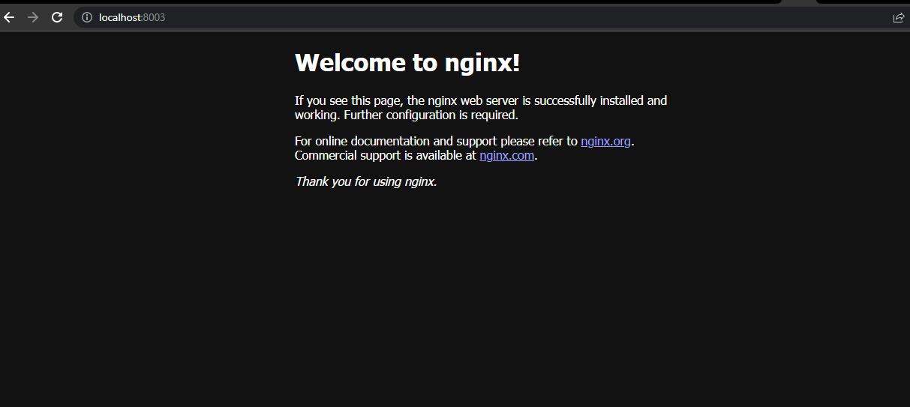
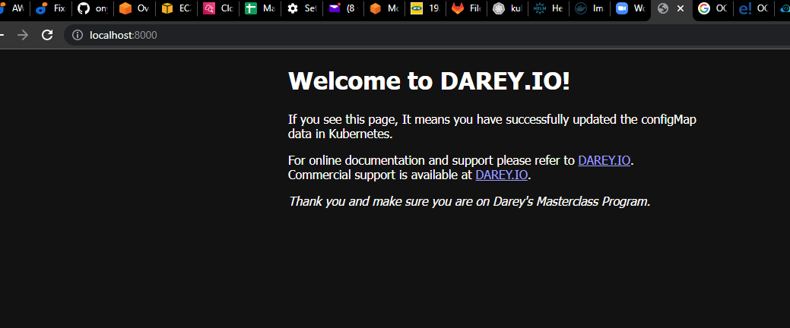
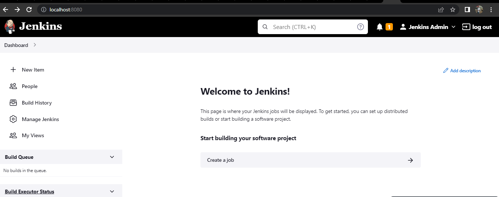

# Project-24

Building EKS with Terraform

**Note**: Use Terraform version v1.0.2 and kubectl version v1.23.6

Open up a new directory on your laptop, and name it **eks**
Use AWS CLI to create an S3 bucket

1. Create a file – backend.tf

```
### Configure S3 Backend
terraform {
  backend "s3" {
    bucket         = "onyi-terraform-state"
    key            = "global/s3-eks-project-24/terraform.tfstate"
    region         = "us-east-2"
    encrypt        = true
  }
}
```

2. Create a file – network.tf and provision Elastic IP for Nat Gateway, VPC, Private and public subnets.

```
# reserve Elastic IP to be used in our NAT gateway
resource "aws_eip" "nat_gw_elastic_ip" {
vpc = true

tags = {
    Name            = "${var.cluster_name}-nat-eip"
    iac_environment = var.iac_environment_tag
    }
  }
# Create VPC using the official AWS module
module "vpc" {
source  = "terraform-aws-modules/vpc/aws"

name = "${var.name_prefix}-vpc"
cidr = var.main_network_block
azs  = data.aws_availability_zones.available_azs.names

private_subnets = [
# this loop will create a one-line list as ["10.0.0.0/20", "10.0.16.0/20", "10.0.32.0/20", ...]
# with a length depending on how many Zones are available
for zone_id in data.aws_availability_zones.available_azs.zone_ids :
cidrsubnet(var.main_network_block, var.subnet_prefix_extension, tonumber(substr(zone_id, length(zone_id) - 1, 1)) - 1)
]

public_subnets = [
# this loop will create a one-line list as ["10.0.128.0/20", "10.0.144.0/20", "10.0.160.0/20", ...]
# with a length depending on how many Zones are available
# there is a zone Offset variable, to make sure no collisions are present with private subnet blocks
for zone_id in data.aws_availability_zones.available_azs.zone_ids :
cidrsubnet(var.main_network_block, var.subnet_prefix_extension, tonumber(substr(zone_id, length(zone_id) - 1, 1)) + var.zone_offset - 1)
]

# Enable single NAT Gateway to save some money
# WARNING: this could create a single point of failure, since we are creating a NAT Gateway in one AZ only
# feel free to change these options if you need to ensure full Availability without the need of running 'terraform apply'
# reference: https://registry.terraform.io/modules/terraform-aws-modules/vpc/aws/2.44.0#nat-gateway-scenarios
enable_nat_gateway     = true
single_nat_gateway     = true
one_nat_gateway_per_az = false
enable_dns_hostnames   = true
reuse_nat_ips          = true
external_nat_ip_ids    = [aws_eip.nat_gw_elastic_ip.id]

# Add VPC/Subnet tags required by EKS
tags = {
    "kubernetes.io/cluster/${var.cluster_name}" = "shared"
    iac_environment                             = var.iac_environment_tag
    }
public_subnet_tags = {
    "kubernetes.io/cluster/${var.cluster_name}" = "shared"
    "kubernetes.io/role/elb"                    = "1"
    iac_environment                             = var.iac_environment_tag
    }
private_subnet_tags = {
    "kubernetes.io/cluster/${var.cluster_name}" = "shared"
    "kubernetes.io/role/internal-elb"           = "1"
    iac_environment                             = var.iac_environment_tag
    }
  }
```

**Note**: The tags added to the subnets is very important. The Kubernetes Cloud Controller Manager (cloud-controller-manager) and AWS Load Balancer Controller (aws-load-balancer-controller) needs to identify the cluster’s. To do that, it querries the cluster’s subnets by using the tags as a filter.

- For public and private subnets that use load balancer resources: each subnet must be tagged
    Key: kubernetes.io/cluster/cluster-name
    Value: shared

- For private subnets that use internal load balancer resources: each subnet must be tagged
    Key: kubernetes.io/role/internal-elb
    Value: 1

- For public subnets that use internal load balancer resources: each subnet must be tagged
    Key: kubernetes.io/role/elb
    Value: 1

3. Create a file – variables.tf

```
# create some variables
variable "cluster_name" {
    type        = string
    description = "EKS cluster name."
}
variable "iac_environment_tag" {
    type        = string
    description = "AWS tag to indicate environment name of each infrastructure object."
}
variable "name_prefix" {
    type        = string
    description = "Prefix to be used on each infrastructure object Name created in AWS."
}
variable "main_network_block" {
    type        = string
    description = "Base CIDR block to be used in our VPC."
}
variable "subnet_prefix_extension" {
    type        = number
    description = "CIDR block bits extension to calculate CIDR blocks of each subnetwork."
}
variable "zone_offset" {
    type        = number
    description = "CIDR block bits extension offset to calculate Public subnets, avoiding collisions with Private subnets."
}
```

4. Create a file – data.tf – This will pull the available AZs for use.

```
# get all available AZs in our region
data "aws_availability_zones" "available_azs" {
    state = "available"
}
data "aws_caller_identity" "current" {} # used for accesing Account ID and ARN
```

## BUILDING ELASTIC KUBERNETES SERVICE (EKS) WITH TERRAFORM – PART 2

5. Create a file – eks.tf and provision EKS cluster (Create the file only if you are not using your existing Terraform code. Otherwise you can simply append it to the main.tf from your existing code) Read more about this module from the official documentation here – Reading it will help you understand more about the rich features of the module.

```
module "eks_cluster" {
  source  = "terraform-aws-modules/eks/aws"
  version = "~> 18.0"
  cluster_name    = var.cluster_name
  cluster_version = "1.22"
  vpc_id     = module.vpc.vpc_id
  subnet_ids = module.vpc.private_subnets
  cluster_endpoint_private_access = true
  cluster_endpoint_public_access = true

  # Self Managed Node Group(s)
  self_managed_node_group_defaults = {
    instance_type                          = var.asg_instance_types[0]
    update_launch_template_default_version = true
  }
  self_managed_node_groups = local.self_managed_node_groups

  # aws-auth configmap
  create_aws_auth_configmap = true
  manage_aws_auth_configmap = true
  aws_auth_users = concat(local.admin_user_map_users, local.developer_user_map_users)
  tags = {
    Environment = "prod"
    Terraform   = "true"
  }
}
```

6. Create a file – locals.tf to create local variables. Terraform does not allow assigning variable to variables. There is good reasons for that to avoid repeating your code unecessarily. So a terraform way to achieve this would be to use locals so that your code can be kept DRY

```
# render Admin & Developer users list with the structure required by EKS module
locals {
  admin_user_map_users = [
    for admin_user in var.admin_users :
    {
      userarn  = "arn:aws:iam::${data.aws_caller_identity.current.account_id}:user/${admin_user}"
      username = admin_user
      groups   = ["system:masters"]
    }
  ]
  developer_user_map_users = [
    for developer_user in var.developer_users :
    {
      userarn  = "arn:aws:iam::${data.aws_caller_identity.current.account_id}:user/${developer_user}"
      username = developer_user
      groups   = ["${var.name_prefix}-developers"]
    }
  ]

  self_managed_node_groups = {
    worker_group1 = {
      name = "${var.cluster_name}-wg"

      min_size      = var.autoscaling_minimum_size_by_az * length(data.aws_availability_zones.available_azs.zone_ids)
      desired_size      = var.autoscaling_minimum_size_by_az * length(data.aws_availability_zones.available_azs.zone_ids)
      max_size  = var.autoscaling_maximum_size_by_az * length(data.aws_availability_zones.available_azs.zone_ids)
      instance_type = var.asg_instance_types[0].instance_type

      bootstrap_extra_args = "--kubelet-extra-args '--node-labels=node.kubernetes.io/lifecycle=spot'"

      block_device_mappings = {
        xvda = {
          device_name = "/dev/xvda"
          ebs = {
            delete_on_termination = true
            encrypted             = false
            volume_size           = 10
            volume_type           = "gp2"
          }
        }
      }

      use_mixed_instances_policy = true
      mixed_instances_policy = {
        instances_distribution = {
          spot_instance_pools = 4
        }

        override = var.asg_instance_types
      }
    }
  }
}
```

7. Add more variables to the variables.tf file

```
# create some variables
variable "admin_users" {
  type        = list(string)
  description = "List of Kubernetes admins."
}
variable "developer_users" {
  type        = list(string)
  description = "List of Kubernetes developers."
}
variable "asg_instance_types" {
  description = "List of EC2 instance machine types to be used in EKS."
}
variable "autoscaling_minimum_size_by_az" {
  type        = number
  description = "Minimum number of EC2 instances to autoscale our EKS cluster on each AZ."
}
variable "autoscaling_maximum_size_by_az" {
  type        = number
  description = "Maximum number of EC2 instances to autoscale our EKS cluster on each AZ."
}
```

8. Create a file – variables.tfvars to set values for variables.

```
cluster_name            = "tooling-app-eks"
iac_environment_tag     = "development"
name_prefix             = "darey-io-eks"
main_network_block      = "10.0.0.0/16"
subnet_prefix_extension = 4
zone_offset             = 8

# Ensure that these users already exist in AWS IAM. Another approach is that you can introduce an iam.tf file to manage users separately, get the data source and interpolate their ARN.
admin_users                    = ["darey", "solomon"]
developer_users                = ["leke", "david"]
asg_instance_types             = [ { instance_type = "t3.small" }, { instance_type = "t2.small" }, ]
autoscaling_minimum_size_by_az = 1
autoscaling_maximum_size_by_az = 10
```

9. Create file – provider.tf

```
provider "aws" {
  region = "us-west-1"
}

provider "random" {
}
```

10. Run Terraform plan – Your plan should have an output

Plan: 41 to add, 0 to change, 0 to destroy.

11. Run Terraform apply

This will begin to create cloud resources, and fail at some point with the error

```
╷
│ Error: Post "http://localhost/api/v1/namespaces/kube-system/configmaps": dial tcp [::1]:80: connect: connection refused
│ 
│   with module.eks-cluster.kubernetes_config_map.aws_auth[0],
│   on .terraform/modules/eks-cluster/aws_auth.tf line 63, in resource "kubernetes_config_map" "aws_auth":
│   63: resource "kubernetes_config_map" "aws_auth" {COPY
That is because for us to connect to the cluster using the kubeconfig, Terraform needs to be able to connect and set the credentials correctly.
```

Let fix the problem in the next section.

### FIXING THE ERROR
To fix this problem

1. Append to the file data.tf

```
# get EKS cluster info to configure Kubernetes and Helm providers
data "aws_eks_cluster" "cluster" {
  name = module.eks_cluster.cluster_id
}
data "aws_eks_cluster_auth" "cluster" {
  name = module.eks_cluster.cluster_id
}
```

2. Append to the file provider.tf
```
# get EKS authentication for being able to manage k8s objects from terraform
provider "kubernetes" {
  host                   = data.aws_eks_cluster.cluster.endpoint
  cluster_ca_certificate = base64decode(data.aws_eks_cluster.cluster.certificate_authority.0.data)
  token                  = data.aws_eks_cluster_auth.cluster.token
}
```

3. Run the init and plan again – This time you will see
```
# module.eks-cluster.kubernetes_config_map.aws_auth[0] will be created
  + resource "kubernetes_config_map" "aws_auth" {
      + data = {
          + "mapAccounts" = jsonencode([])
          + "mapRoles"    = <<-EOT
                - "groups":
                  - "system:bootstrappers"
                  - "system:nodes"
                  "rolearn": "arn:aws:iam::696742900004:role/tooling-app-eks20210718113602300300000009"
                  "username": "system:node:{{EC2PrivateDNSName}}"
            EOT
          + "mapUsers"    = <<-EOT
                - "groups":
                  - "system:masters"
                  "userarn": "arn:aws:iam::696742900004:user/dare"
                  "username": "dare"
                - "groups":
                  - "system:masters"
                  "userarn": "arn:aws:iam::696742900004:user/solomon"
                  "username": "solomon"
                - "groups":
                  - "darey-io-eks-developers"
                  "userarn": "arn:aws:iam::696742900004:user/leke"
                  "username": "leke"
                - "groups":
                  - "darey-io-eks-developers"
                  "userarn": "arn:aws:iam::696742900004:user/david"
                  "username": "david"
            EOT
        }
      + id   = (known after apply)

      + metadata {
          + generation       = (known after apply)
          + labels           = {
              + "app.kubernetes.io/managed-by" = "Terraform"
              + "terraform.io/module"          = "terraform-aws-modules.eks.aws"
            }
          + name             = "aws-auth"
          + namespace        = "kube-system"
          + resource_version = (known after apply)
          + uid              = (known after apply)
        }
    }
```

Plan: 1 to add, 0 to change, 0 to destroy.

4. Create kubeconfig file using awscli.

```
aws eks update-kubecofig --name <cluster_name> --region <cluster_region> --kubeconfig kubeconfig
```

**Note**: The above eks module version deploys kubernates version 1.22 which is an older version that requires some plugins before it can worfk successfully. Therefore we will use the eks module latest version at https://github.com/onyeka-hub/terraform-eks-module-official.git

## HELM

Install helm in your computer.
### DEPLOY APPLICATIONS WITH HELM
In Project 23, you experienced the use of manifest files to define and deploy resources like pods, deployments, configmap and services into Kubernetes cluster. Here, you will do the same thing except that it will not be passed through kubectl. In the real world, Helm is the most popular tool used to deploy resources into kubernetes. That is because it has a rich set of features that allows deployments to be packaged as a unit. Rather than have multiple YAML files managed individually – which can quickly become messy.

A Helm chart is a definition of the resources that are required to run an application in Kubernetes. Instead of having to think about all of the various deployments/services/volumes/configmaps/ etc that make up your application, you can use a command like

```
helm install stable/mysql
```

and Helm will make sure all the required resources are installed. In addition you will be able to tweak helm configuration by setting a single variable to a particular value and more or less resources will be deployed. For example, enabling slave for MySQL so that it can have read only replicas.

Behind the scenes, a helm chart is essentially a bunch of YAML manifests that define all the resources required by the application. Helm takes care of creating the resources in Kubernetes (where they don’t exist) and removing old resources.

### Lets begin to gradually walk through how to use Helm
Parameterising YAML manifests using Helm templates

Let’s consider that our Tooling app have been Dockerised into an image called tooling-app, and that you wish to deploy with Kubernetes. Without helm, you would create the YAML manifests defining the deployment, service, and ingress, and apply them to your Kubernetes cluster using kubectl apply. Initially, your application is version 1, and so the Docker image is tagged as tooling-app:1.0.0. A simple deployment manifest might look something like the following:

```
apiVersion: apps/v1
kind: Deployment
metadata:
  name: tooling-app-deployment
  labels:
    app: tooling-app
spec:
  replicas: 3
  strategy: 
    type: RollingUpdate
    rollingUpdate:
      maxUnavailable: 1
  selector:
    matchLabels:
      app: tooling-app
  template:
    metadata:
      labels:
        app: tooling-app
    spec:
      containers:
      - name: tooling-app
        image: "tooling-app:1.0.0"
        ports:
        - containerPort: 80
```
Now lets imagine you produce another version of your app, version 1.1.0. How do you deploy that? Assuming nothing needs to be changed with the service or ingress, it may be as simple as copying the deployment manifest and replacing the image defined in the spec section. You would then re-apply this manifest to the cluster, and the deployment would be updated, performing a rolling-update as I described in my first post.

The main problem with this is that all of the values specific to your application – the labels and the image names etc – are mixed up with the "mechanical" definition of the manifest.

Helm tackles this by splitting the configuration of a chart out from its basic definition. For example, instead of baking the name of your app or the specific container image into the manifest, you can provide those when you install the chart into the cluster.

For example, a simple templated version of the previous deployment might look like the following:

```
apiVersion: apps/v1
kind: Deployment
metadata:
  name: {{ .Release.Name }}-deployment
  labels:
    app: "{{ template "name" . }}"
spec:
  replicas: 3
  strategy: 
    type: RollingUpdate
    rollingUpdate:
      maxUnavailable: 1
  selector:
    matchLabels:
      app: "{{ template "name" . }}"
  template:
    metadata:
      labels:
        app: "{{ template "name" . }}"
    spec:
      containers:
      - name: "{{ template "name" . }}"
        image: "{{ .Values.image.name }}:{{ .Values.image.tag }}"
        ports:
        - containerPort: 80
```

This example demonstrates a number of features of Helm templates:

The template is based on YAML, with {{ }} mustache syntax defining dynamic sections.
Helm provides various variables that are populated at install time. For example, the {{.Release.Name}} allows you to change the name of the resource at runtime by using the release name. Installing a Helm chart creates a release (this is a Helm concept rather than a Kubernetes concept).
You can define helper methods in external files. The {{template "name"}} call gets a safe name for the app, given the name of the Helm chart (but which can be overridden). By using helper functions, you can reduce the duplication of static values (like tooling-app), and hopefully reduce the risk of typos.

You can manually provide configuration at runtime. The {{.Values.image.name}} value for example is taken from a set of default values, or from values provided when you call helm install. There are many different ways to provide the configuration values needed to install a chart using Helm. Typically, you would use two approaches:

A values.yaml file that is part of the chart itself. This typically provides default values for the configuration, as well as serving as documentation for the various configuration values.

When providing configuration on the command line, you can either supply a file of configuration values using the -f flag. We will see a lot more on this later on.

### Create a chart
Create a folder called helm and cd into the folder. Run the helm create command
To create a new chart for you:

helm create chart-name

```
helm create ecommerce
```
where ecommerce is the name of the chart. 

This will create a file tree structure like this below:

```
ecommerce/
  Chart.yaml          # A YAML file containing information about the chart
  LICENSE             # OPTIONAL: A plain text file containing the license for the chart
  README.md           # OPTIONAL: A human-readable README file
  values.yaml         # The default configuration values for this chart
  values.schema.json  # OPTIONAL: A JSON Schema for imposing a structure on the values.yaml file
  charts/             # A directory containing any charts upon which this chart depends.
  crds/               # Custom Resource Definitions
  templates/          # A directory of templates that, when combined with values,
                      # will generate valid Kubernetes manifest files.
  templates/NOTES.txt # OPTIONAL: A plain text file containing short usage notes
```
We are going to generate a new content for our file. Therefore delete the content of values.yaml file and also the content of the template directory exept the _helper.tpl file.

#### To convert a pre-existing application into a helm chart
Copy our existing yaml files for our kubernates objects/microservices such as the deployment.yaml, service.yaml, configmap.yaml, secret.yaml and paste into the template folder.

### Helm --debug and --dry-run command
When you want to test the template rendering, but not actually install anything, you can use
```
helm install --debug --dry-run <release name> <chart name>
OR
helm upgrade -install --debug --dry-run <release name> <chart name>
```
This will render the templates. But instead of installing the chart, it will return the rendered template to you so you can see the output.

#### Helm template command
This works the same as --debug and --dry-run command and is used to test if the chart is rendered correctly. This is a powerful tool/command that allows us to test our template by spitting out the raw kubernates yaml files, so we can make sure its OK. If any thing is wrong with our template, the helm template command will bring out an error.
```
helm template <chart name>
```

```
$ helm template ecommerce
---
# Source: ecommerce/templates/nginx-configmap.yaml
apiVersion: v1
kind: ConfigMap
metadata:
  name: website-index-file
data:
  # file to be mounted inside a volume
  index-file: |
    <!DOCTYPE html>
    <html>
    <head>
    <title>Welcome to nginx!</title>
    <style>
    html { color-scheme: light dark; }
    body { width: 35em; margin: 0 auto;
    font-family: Tahoma, Verdana, Arial, sans-serif; }
    </style>
    </head>
    <body>
    <h1>Welcome to nginx!</h1>
    <p>If you see this page, the nginx web server is successfully installed and
    working. Further configuration is required.</p>

    <p>For online documentation and support please refer to
    <a href="http://nginx.org/">nginx.org</a>.<br/>
    Commercial support is available at
    <a href="http://nginx.com/">nginx.com</a>.</p>

    <p><em>Thank you for using nginx.</em></p>
    </body>
    </html>
---
# Source: ecommerce/templates/nginx-service.yaml
apiVersion: v1
kind: Service
metadata:
  name: nginx-service
spec:
  selector:
    tier: frontend
  ports:
    - protocol: TCP
      port: 80
      targetPort: 80
---
# Source: ecommerce/templates/deployment.yaml
apiVersion: apps/v1
kind: Deployment
metadata:
  name: nginx-deployment
  labels:
    tier: frontend
spec:
  replicas: 1
  selector:
    matchLabels:
      tier: frontend
  template:
    metadata:
      labels:
        tier: frontend
    spec:
      containers:
      - name: nginx
        image: nginx:latest
        ports:
        - containerPort: 80
        volumeMounts:
          - name: config
            mountPath: /usr/share/nginx/html
            readOnly: true
      volumes:
      - name: config
        configMap:
          name: website-index-file
          items:
          - key: index-file
            path: index.html
```

#### Install chart

helm install <release name> <chart name>
```
helm install auth ecommerce -n dev
```

This will install and deploy all the files in the template folder into kubernates cluster. This creates a release.

```
NAME: auth
LAST DEPLOYED: Wed Nov  9 16:39:24 2022
NAMESPACE: dev
STATUS: deployed
REVISION: 1

$ helm ls -n dev
NAME            NAMESPACE       REVISION        UPDATED                                 STATUS          CHART                    APP VERSION
auth             dev             1               2022-11-09 16:39:24.1509851 +0100 WAT   deployed        example-app-0.0.1        1.0.0
```
Port forward the service
```
kubectl port-forward svc/nginx-service 8003:80 -n dev
```


To list the release do : helm list or helm ls

To list all the objects : kubectl get all -n namespace

To get the configmap: kubectl get cm

To get the secret: kubectl get secret

### Values file
The values file and parameter injection allows us to inject valus into our chart making it re-usable. This allows us to change the hard-coded values in our yaml file into variables.
Example: In the dseployment.yaml file, where you have `image: nginx:1.2.3` can be changed to `image: {{ .values.deployment.image }}:{{ .values.deployment.tag }}` .

In the values.yaml file, put

```
deployment:
  image: "nginx"
  tag: "latest"
```

Run the helm upgrade command
helm  upgrade <release name> <chart name> -n dev

```
helm upgrade auth ecommerce -n dev
```
```
Release "auth" has been upgraded. Happy Helming!
NAME: auth
LAST DEPLOYED: Wed Nov  9 17:08:48 2022
NAMESPACE: dev
STATUS: deployed
REVISION: 2
TEST SUITE: None
```

#### The --set flag
To overwrite any value at run time , use --set flag
Example: helm upgrade auth helm --set deployment.tag=1.2.3

### To make our chart more generic and re-usable
This is to inject all the custom name for all the object in the yaml file.
Example: For the follwing object, replace `nginx-deployment` in all the files and inject `"{{ .values.name }}"`. 

Inside ecommerce folder create three folders for dev, staging and prod. Inside dev folder create two value files, auth-values.yaml and cart-values.yaml for both auth and cart microservices. Copy the values.yaml file into the two yaml files.

In all the yaml files replace all the common items/names with variables and there subsequent values in the values.yaml file. Below are the deployment.yaml, nginx-service.yaml, nginx-configmap.yaml and the values.yaml files: 

```
# deployment.yaml
apiVersion: apps/v1
kind: Deployment
metadata:
  name: "{{ .Values.name }}-deployment"
  labels:
    app: "{{ .Values.name }}"
spec:
  replicas: {{ .Values.replicaCount }}
  selector:
    matchLabels:
      app: "{{ .Values.name }}"
  template:
    metadata:
      labels:
        app: "{{ .Values.name }}"
    spec:
      containers:
      - name: "{{ .Values.appName }}"
        image: "{{ .Values.image_name }}:{{ .Values.image_tag }}"
        ports:
        - containerPort: {{ .Values.containerPort }}
        volumeMounts:
          - name: "{{ .Values.name }}-config"
            mountPath: /usr/share/nginx/html
            readOnly: true
      volumes:
      - name: "{{ .Values.name }}-config"
        configMap:
          name: "{{ .Values.name }}-website-index-file"
          items:
          - key: index-file
            path: index.html
```

```
# nginx-service.yaml
apiVersion: v1
kind: Service
metadata:
  name: "{{ .Values.name }}-nginx-service"
spec:
  selector:
    app: "{{ .Values.name }}"
  ports:
    - protocol: TCP
      port: 80
      targetPort: 80
```

```
# nginx-configmap.yaml
apiVersion: v1
kind: ConfigMap
metadata:
  name: "{{ .Values.name }}-website-index-file"
data:
  # file to be mounted inside a volume
  index-file: |
    <!DOCTYPE html>
    <html>
    <head>
    <title>Welcome to nginx!</title>
    <style>
    html { color-scheme: light dark; }
    body { width: 35em; margin: 0 auto;
    font-family: Tahoma, Verdana, Arial, sans-serif; }
    </style>
    </head>
    <body>
    <h1>Welcome to nginx!</h1>
    <p>If you see this page, the nginx web server is successfully installed and
    working. Further configuration is required.</p>

    <p>For online documentation and support please refer to
    <a href="http://nginx.org/">nginx.org</a>.<br/>
    Commercial support is available at
    <a href="http://nginx.com/">nginx.com</a>.</p>

    <p><em>Thank you for using nginx.</em></p>
    </body>
    </html>
```

```
name: auth
image_name: nginx
image_tag: "alpine"
replicaCount: 1
appName: nginx
containerPort: 80
```

Run : helm template ecommerce

Output
```
---
# Source: ecommerce/templates/nginx-configmap.yaml
apiVersion: v1
kind: ConfigMap
metadata:
  name: "auth-website-index-file"
data:
  # file to be mounted inside a volume
  index-file: |
    <!DOCTYPE html>
    <html>
    <head>
    <title>Welcome to nginx!</title>
    <style>
    html { color-scheme: light dark; }
    body { width: 35em; margin: 0 auto;
    font-family: Tahoma, Verdana, Arial, sans-serif; }
    </style>
    </head>
    <body>
    <h1>Welcome to nginx!</h1>
    <p>If you see this page, the nginx web server is successfully installed and
    working. Further configuration is required.</p>

    <p>For online documentation and support please refer to
    <a href="http://nginx.org/">nginx.org</a>.<br/>
    Commercial support is available at
    <a href="http://nginx.com/">nginx.com</a>.</p>

    <p><em>Thank you for using nginx.</em></p>
    </body>
    </html>
---
# Source: ecommerce/templates/nginx-service.yaml
apiVersion: v1
kind: Service
metadata:
  name: "auth-nginx-service"
spec:
  selector:
    app: "auth"
  ports:
    - protocol: TCP
      port: 80
      targetPort: 80
---
# Source: ecommerce/templates/deployment.yaml
apiVersion: apps/v1
kind: Deployment
metadata:
  name: "auth-deployment"
  labels:
    app: "auth"
spec:
  replicas: 1
  selector:
    matchLabels:
            readOnly: true
      volumes:
      - name: "auth-config"
        configMap:
          name: "auth-website-index-file"
          items:
          - key: index-file
            path: index.html
```
Delete the previous release and install a new one

```
helm install auth ecommerce -n dev
```
### Upgrading our App
Update the configmap with the below code:

```
apiVersion: v1
kind: ConfigMap
metadata:
  name: "{{ .Values.name }}-website-index-file"
data:
  # file to be mounted inside a volume
  index-file: |
    <!DOCTYPE html>
    <html>
    <head>
    <title>Welcome to Onyeka's world!</title>
    <style>
    html { color-scheme: light dark; }
    body { width: 35em; margin: 0 auto;
    font-family: Tahoma, Verdana, Arial, sans-serif; }
    </style>
    </head>
    <body>
    <h1>Welcome to Onyeka's world!</h1>
    <p>If you see this page, It means you have successfully updated the configMap data in Kubernetes.</p>

    <p>For online documentation and support please refer to
    <a href="http://DAREY.IO/">DAREY.IO</a>.<br/>
    Commercial support is available at
    <a href="http://DAREY.IO/">DAREY.IO</a>.</p>

    <p><em>Thank you and make sure you are on Darey's Masterclass Program.</em></p>
    </body>
    </html>
```
Run helm upgrade
```
helm upgrade auth ecommerce -n dev
```
Output

```
Release "auth" has been upgraded. Happy Helming!
NAME: auth
LAST DEPLOYED: Thu Nov 10 13:43:43 2022
NAMESPACE: dev
STATUS: deployed
REVISION: 2
TEST SUITE: None
```


### To authomatically roll out new pod when a configmap changes
By default in kubernates, when a configmap changes, pods are not authomatically updated/restarted and some application might need to restart to pick up new config file. So when a configmap changes the pods in kubernates wont authomatically pick up the new changes. We can use helm template generation capabilities to overcome this issue and it allows us to forcefuly roll out new pods when the configmap changes. To do this update the annotations in the deployment.yaml file as below

```
deployment.yaml

kind: Deployment
spec:
  template:
    metadata:
      annotations:
        checksum/config: {{ include (print$.Template.BasePath "/configmap.yaml") . | sha256sum }}
```
This will check for any changes in  the configmap and roll out new pods with the new config files in the event of any chage in the configuration file.

### To create another different release with the chart
Because our application is generic, it can be used to deploy another copy of it or another micrservice.
In side the dev folder earlier created, create two files. auth-values.yaml and cart-values.yaml. The values.yaml will be used as default values file when no file is specified during run time either with --values or --set commands. To install a new release, run helm install or upgrade and point the values to the respective values with the --values command.

```
# auth-values.yaml
name: auth
image_name: nginx
image_tag: "alpine"
replicaCount: 3
appName: nginx
containerPort: 80

# cart-values.yaml
name: cart
image_name: nginx
image_tag: "stable-perl"
replicaCount: 5
appName: nginx
containerPort: 80
```

#### Install or Upgrade a Release with One Command
Helm provides a way to perform an install-or-upgrade as a single command. Use helm upgrade with the --install command. This will cause Helm to see if the release is already installed. If not, it will run an install. If it is, then the existing release will be upgraded.

Run: helm upgrade --install <release name> <chart name> --values <absolute path of the values file> 

```
helm upgrade --install auth ecommerce --values C:/Users/ONYEKA/OneDrive/Documents/onyeka-workspace/Project-24/helm/ecommerce/dev/auth-values.yaml -n dev
```
And for the second microservice
```
helm upgrade --install cart ecommerce --values C:/Users/ONYEKA/OneDrive/Documents/onyeka-workspace/Project-24/helm/ecommerce/dev/cart-values.yaml -n dev
```

```
Release "auth" does not exist. Installing it now.
NAME: auth
LAST DEPLOYED: Thu Nov 10 17:31:33 2022
NAMESPACE: dev
STATUS: deployed
REVISION: 1
TEST SUITE: None


Release "cart" does not exist. Installing it now.
NAME: cart
LAST DEPLOYED: Thu Nov 10 17:30:09 2022
NAMESPACE: dev
STATUS: deployed
REVISION: 1
TEST SUITE: None
```
helm ls
Output
```
NAME    NAMESPACE       REVISION        UPDATED                                 STATUS          CHART            APP VERSION
auth    dev             1               2022-11-10 17:31:33.7682955 +0100 WAT   deployed        ecommerce-0.0.1  0.0.1
cart    dev             1               2022-11-10 17:30:09.4578455 +0100 WAT   deployed        ecommerce-0.0.1  0.0.1
```

### Using Helm to Manage Charts
The helm tool has several commands for working with charts.

Once you have edited a chart, helm can package it into a chart archive for you:

$ helm package mychart
Archived mychart-0.1.-.tgz


You can also use helm to help you find issues with your chart's formatting or information:

$ helm lint mychart
No issues found

## DEPLOY JENKINS WITH HELM
Before we begin to develop our own helm charts, lets make use of publicly available charts to deploy all the tools that we need.

One of the amazing things about helm is the fact that you can deploy applications that are already packaged from a public helm repository directly with very minimal configuration. An example is **Jenkins**.

1. Visit Artifact Hub to find packaged applications as Helm Charts
2. Search for Jenkins
3. Add the repository to helm so that you can easily download and deploy
```
helm repo add jenkins https://charts.jenkins.io
```
4. Update helm repo
```
helm repo update 
```
5. Install the chart
```
helm install [RELEASE_NAME] jenkins/jenkins --kubeconfig [kubeconfig file] -n dev
```
Path to the kubeconfig file: C:/Users/ONYEKA/.kube/config

helm install jenkins jenkins/jenkins --kubeconfig C:/Users/ONYEKA/.kube/config -n dev

You should see an output like this
```
$ helm install jenkins jenkinsci/jenkins --version 4.2.14 -n dev
NAME: jenkins
LAST DEPLOYED: Sat Nov 19 16:48:42 2022
NAMESPACE: dev
STATUS: deployed
REVISION: 1
NOTES:
1. Get your 'admin' user password by running:
  kubectl exec --namespace dev -it svc/jenkins -c jenkins -- /bin/cat /run/secrets/additional/chart-admin-password && echo
2. Get the Jenkins URL to visit by running these commands in the same shell:
  echo http://127.0.0.1:8080
  kubectl --namespace dev port-forward svc/jenkins 8080:8080

3. Login with the password from step 1 and the username: admin
4. Configure security realm and authorization strategy
5. Use Jenkins Configuration as Code by specifying configScripts in your values.yaml file, see documentation: http:///configuration-as-code and examples: https://github.com/jenkinsci/configuration-as-code-plugin/tree/master/demos

For more information on running Jenkins on Kubernetes, visit:
https://cloud.google.com/solutions/jenkins-on-container-engine

For more information about Jenkins Configuration as Code, visit:
https://jenkins.io/projects/jcasc/


NOTE: Consider using a custom image with pre-installed plugins
```

6. Check the Helm deployment
```
helm ls --kubeconfig [kubeconfig file]
```
Output:
```
NAME    NAMESPACE       REVISION        UPDATED                                 STATUS          CHART           APP VERSION
jenkins dev            1               2021-08-01 12:38:53.429471 +0100 BST    deployed        jenkins-3.5.9   2.289.3 
```

7. Check the pods
```
kubectl get pods --kubeconfig [kubeconfig file]
```
Output:

NAME        READY   STATUS    RESTARTS   AGE
jenkins-0   2/2     Running   0          6m14s

8. Describe the running pod (review the output and try to understand what you see)
```
kubectl describe pod jenkins-0 --kubeconfig [kubeconfig file]
```
9. Check the logs of the running pod
```
kubectl logs jenkins-0 --kubeconfig [kubeconfig file]
```
You will notice an output with an error

error: a container name must be specified for pod jenkins-0, choose one of: [jenkins config-reload] or one of the init containers: [init]

This is because the pod has a Sidecar container alongside with the Jenkins container. As you can see from the error output, there is a list of containers inside the pod [jenkins config-reload] i.e jenkins and config-reload containers. The job of the config-reload is mainly to help Jenkins to reload its configuration without recreating the pod.

Therefore we need to let kubectl know, which pod we are interested to see its log. Hence, the command will be updated like:
```
kubectl logs jenkins-0 -c jenkins --kubeconfig [kubeconfig file]
```

10. Now lets avoid calling the [kubeconfig file] everytime. Kubectl expects to find the default kubeconfig file in the location ~/.kube/config. But what if you already have another cluster using that same file? It doesn’t make sense to overwrite it. What you will do is to merge all the kubeconfig files together using a kubectl plugin called [konfig](https://github.com/corneliusweig/konfig) and select whichever one you need to be active.

  1. Install a package manager for kubectl called krew so that it will enable you to install plugins to extend the functionality of kubectl. Read more about it [Here](https://github.com/kubernetes-sigs/krew)

  2. Install the [konfig plugin](https://github.com/corneliusweig/konfig)
  ```
    kubectl krew install konfig
  ```
  3. Import the kubeconfig into the default kubeconfig file. Ensure to accept the prompt to overide.
  ```
    sudo kubectl konfig import --save  [kubeconfig file]
  ```
  4. Show all the contexts – Meaning all the clusters configured in your kubeconfig. If you have more than 1 Kubernetes clusters configured, you will see them all in the output.
  ```
    kubectl config get-contexts
  ```
  5. Set the current context to use for all kubectl and helm commands
  ```
    kubectl config use-context [name of EKS cluster]
  ```
  6. Test that it is working without specifying the --kubeconfig flag
  ```
    kubectl get po
  ```
  Output:

    NAME        READY   STATUS    RESTARTS   AGE
    jenkins-0   2/2     Running   0          84m

  7. Display the current context. This will let you know the context in which you are using to interact with Kubernetes.
  ```
    kubectl config current-context
  ```

11. Now that we can use kubectl without the --kubeconfig flag, Lets get access to the Jenkins UI. (In later projects we will further configure Jenkins. For now, it is to set up all the tools we need)

  1. There are some commands that was provided on the screen when Jenkins was installed with Helm. See number 5 above. Get the password to the admin user
  ```
  kubectl exec --namespace dev -it svc/jenkins -c jenkins -- /bin/cat /run/secrets/chart-admin-password && echo
  ```
  2. Use port forwarding to access Jenkins from the UI
  ```
  kubectl --namespace dev port-forward svc/jenkins 8080:8080
  ```

  3. Go to the browser localhost:8080 and authenticate with the username and password from number 1 above



